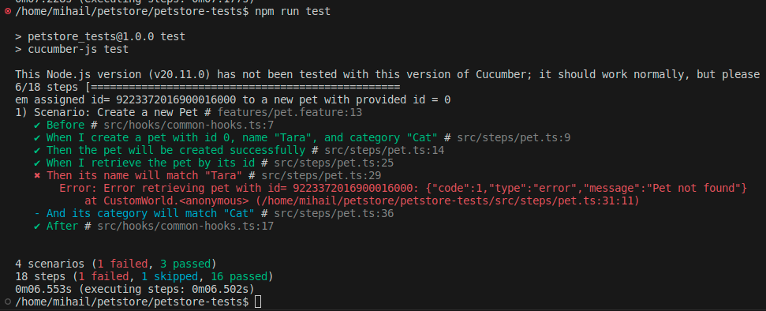
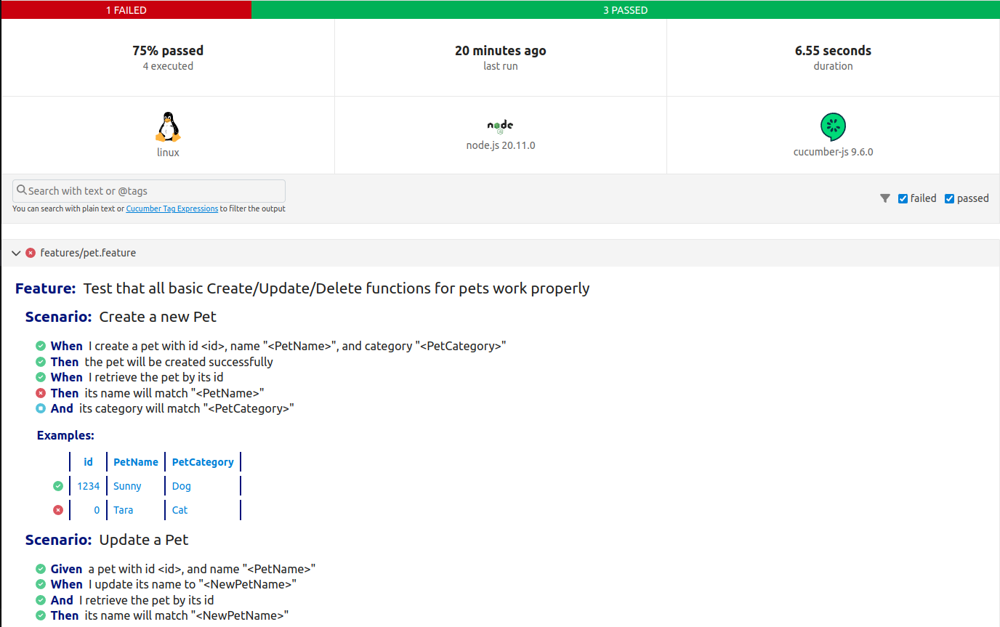

# Petstore automated API tests

This project demonstrates simple Cucumber-Playwright-TypeScript setup to test the [petstore API](https://petstore.swagger.io/). It focues on simple CRUD operations with emphasize on POST to /pet endpoint.

Explanation of the implementation can be found [here](./docs/Explanation.md).

## Running the tests
To run the tests, first install all dependencies
```bash
npm install
```
then type:

```bash
npm run test
```
If configured properly, this should produce the following output:


Due to a bug in the application under test, one of the tests is failing.

To view the test report with your favourite browser(e.g. chromium), type:
```bash
chromium reports/cucumber-report.html
```
You should see something like this:
