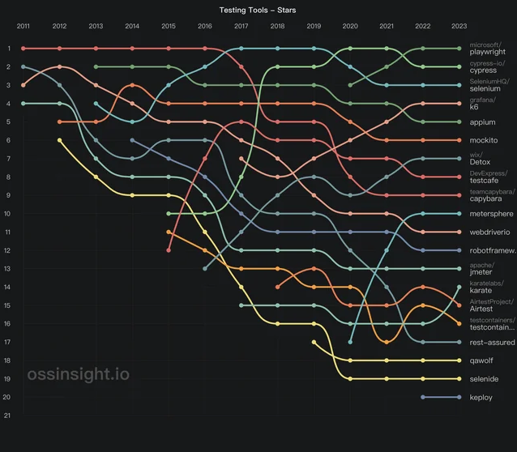

# Explanation

This is a brief explanation of the solution.

## Why Playwright?

While there are many tools for API testing, including some specialized ones for testing APIs only, this solution uses Playwright. The reason is that Playwright is a great tool for UI testing and it is probably better to use the same framework across both API and UI.

In addition, according to some studies, Playwright is becoming the nunmber one framework for E2E testing: 

Jest is definitely another great option but it is better for low level unit tests rather than E2E testing.

## High level design of tha automation solution
Apart from the boilerplate framework configuration code, this solution has just a few classes that encapsulate the main business logic.

[features/pet.feature](../features/pet.feature) has simple Gherkin for CRUD operations on pets. The goal here is to use language understandable by non technical stakeholders.

[src/steps/pet.ts](../src/steps/pet.ts) has the code executing the steps. The goal here is to have steps that are reusable across different scenarios. For example, the step 'When I retrieve the pet by its id' is reused across multiple test scenarios. In addition, steps classes do not contain the core business logic of the solution, just step definitions and assertions. The business logic is abstracted into API classes following the separation of concerns principle.

[src/api/PetAPI.ts](../src/api/PetAPI.ts) has all the API logic. Similarly to Page Objects in UI testing solutions, the API objects encapsulate logic for communicating with the API.

##  Obserations about the system under test
While the main prupose of this solution is to demonstrate Cucumber + Playwright for API testing, in the course of creating the tests I discovered some potentially erroneos behavior of the Petstore app: when a pet is created with id < 1, the system automatically assignes some seemingly random ID. Sometimes the id assigned is too big, resulting in a Number Format Exception when trying to get the pet by id. Somtimes the id is just the id of another pet. I assumes that the intent here is when id = 0, to assign automatically a unique id e.g. through a db sequence because creating a new pet and providing its id is a bit clunky.Therefore there is a failing test which should pass once the bug is fixed.

## Is Cucumber + Playwright a good combination?
Cucumber is a great framework for doing BDD. It plays fairly well with Playwright when it comes to API testing. However, when it comes to UI testing, Cucumber actually negates some of the most useful features of Playwright because it replaces the prominent Playwright JS runner which brings some great features like DOM tree capturing, Network traffic capturing, and JS Console capturing to name a few. Therefore, it is better to **avoid** Cucumber for UI testing with Playwright. The same results can be achieved with Playwright alone through the use of describe, test, and step to produce non technical, business oriented reports of all executed tests.

**Disclaimer:** while I have used many tools for testing APIs, this is the first time I use Playwright + Cucumber. 